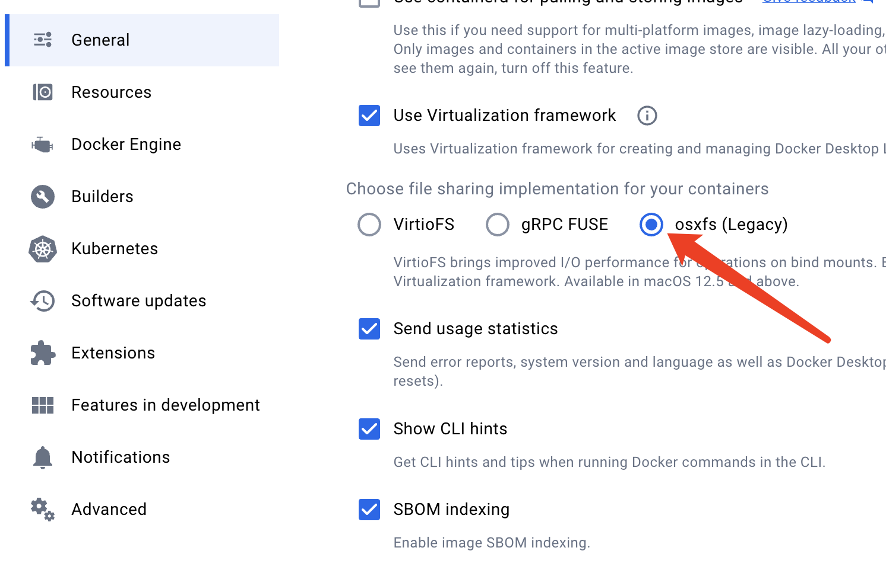

公有链和联盟链的区别

使用的语言和区块链平台

前置环境安装，像Go语言环境

JAVA项目启动报错的话需要修改私钥，覆盖原来的私钥地址，因为电脑重启了

1.其他安装和测试步骤参考：
https://www.jianshu.com/p/cd05e966a6a8?utm_campaign=maleskine...&utm_content=note&utm_medium=seo_notes

2.1.4.0版本的./bootstraps.sh执行下载地址不对，修改下载地址url; 下载耗时过长，手动去github下载指定tar.gz解压后将bin和config文件夹放到fabric-samples目录中；测试使用的是fabric-samples工程；保存修改后的 [bootstrap.sh](../workspace/Go/src/github.com/hyperledger/fabric/scripts/bootstrap.sh) 脚本文件，虽然不用它拉项目，但是可以用来拉docker镜像。

.启动测试网报错：
Error: Could not assemble transaction, err Proposal response was not successful, error code 500, msg error starting container: error starting container: Post http://unix.sock/containers/create?name=dev-peer0.org2.example.com-mycc-1.0: dial unix /host/var/run/docker.sock: connect: no such file or directory

修改为勾选osxfs解决

https://github.com/hyperledger/fabric-ca/releases/download/v1.4.0/hyperledger-fabric-ca-darwin-amd64-1.4.0.tar.gz

https://github.com/hyperledger/fabric/releases/download/v1.4.0/hyperledger-fabric-darwin-amd64-1.4.0.tar.gz

###### 链码部署相关问题

1.使用java编写链码部署一直超时不成功，jar方式也尝试过，依然不成功。采用go语言部署链码成功

2. go语言链码部署相关指令

   1）查看已部署链码

   peer chaincode list --installed

   2）查看已实例化链码

   peer chaincode list --instantiated -C mychannel

   3）链码部署

   peer chaincode install -n encryptionCC -v 1.9 -l golang -p github.com/chaincode/postal/

   

   peer chaincode install -n auditCC2 -v 1.6 -l golang -p github.com/chaincode/audit/

   4）链码实例化

   peer chaincode instantiate -o orderer.example.com:7050 --tls --cafile /opt/gopath/src/github.com/hyperledger/fabric/peer/crypto/ordererOrganizations/example.com/orderers/orderer.example.com/msp/tlscacerts/tlsca.example.com-cert.pem -C mychannel -n encryptionCC -l golang -v 1.9 -c '{"Args":["init"]}' -P "OR ('Org1MSP.peer','Org2MSP.peer')"

   

   peer chaincode instantiate -o orderer.example.com:7050 --tls --cafile /opt/gopath/src/github.com/hyperledger/fabric/peer/crypto/ordererOrganizations/example.com/orderers/orderer.example.com/msp/tlscacerts/tlsca.example.com-cert.pem -C mychannel -n auditCC2 -l golang -v 1.6 -c '{"Args":["init"]}' -P "OR ('Org1MSP.peer','Org2MSP.peer')"

   4）链码升级

   peer chaincode upgrade -o orderer.example.com:7050 --tls --cafile /opt/gopath/src/github.com/hyperledger/fabric/peer/crypto/ordererOrganizations/example.com/orderers/orderer.example.com/msp/tlscacerts/tlsca.example.com-cert.pem -C mychannel -n encryptionCC -v 1.2 -c '{"Args":["init"]}' -P "OR ('Org1MSP.peer','Org2MSP.peer')"

   5）进入docker

   docker exec -it cli bash

   6）链码路径

   /opt/gopath/src/github.com/chaincode