# BlockchainPostalSystem

This project uses Hyperledger Fabric + Java SpringBoot + JS + Go to implement a data-secure postal system based on blockchain technology smart contracts.
1. Encrypt the data before storing it on the chain and decrypt it after reading the data on the chain in order to enhance the data security of the system. Also experiment with different data encryption algorithms.
2. By designing and implementing the audit chain to ensure the tamperability and traceability of the data.

GitLab: [BlockchainPostalSystem](https://projects.cs.nott.ac.uk/psxcy8/blockchainpostalsystem/-/tree/master?ref_type=heads)

## Project Structure
- `crypto-config` - Contains the crypto-config files for the network
- `src/main/java/com/postal` - Contains the Java SpringBoot backend code
- `src/main/resources` - Contains the application.properties file and the static files for the frontend
- `connection.json` - The connection profile for the Hyperledger network
- `src/main/resources/application.yml` - The application configuration file
- `pom.xml` - The Maven project file
- `wallet` - Contains the wallet files for the network (Auto-generated when running the project)
- `smart-contracts` - The smart contract codes by Go. Copy each .go file to your path.

## Environmental Preparation
- Install Docker
- Install Docker Compose
- Install Go
- Install Node.js
- Install npm
- Install Java version 1.8 or higher
- Install Maven
- Install Hyperledger Fabric and deploy the network on your local machine, see [**Fabric Deployment and Development Notes.md**] and the [official documentation](https://hyperledger-fabric.readthedocs.io/en/release-2.2/test_network.html) for more details
- Install Hyperledger Fabric Explorer

## Change Configuration Files
- Modify the `connection.json` file and the `application.yml` file to match your network configuration.
- Only the private key needs to be changed, as it is reset every time the Hyperledger network is restarted.

## Deploy Chaincode
1. Deploy chaincode:
    ```sh
    docker exec -it cli bash
    peer chaincode install -n encryptionCC -v 1.9 -l golang -p github.com/chaincode/postal/
    peer chaincode install -n auditCC2 -v 1.6 -l golang -p github.com/chaincode/audit/
    ```

2. Chaincode instantiation:
    ```sh
    peer chaincode instantiate -o orderer.example.com:7050 --tls --cafile /opt/gopath/src/github.com/hyperledger/fabric/peer/crypto/ordererOrganizations/example.com/orderers/orderer.example.com/msp/tlscacerts/tlsca.example.com-cert.pem -C mychannel -n encryptionCC -l golang -v 1.9 -c '{"Args":["init"]}' -P "OR ('Org1MSP.peer','Org2MSP.peer')"
    peer chaincode instantiate -o orderer.example.com:7050 --tls --cafile /opt/gopath/src/github.com/hyperledger/fabric/peer/crypto/ordererOrganizations/example.com/orderers/orderer.example.com/msp/tlscacerts/tlsca.example.com-cert.pem -C mychannel -n auditCC2 -l golang -v 1.6 -c '{"Args":["init"]}' -P "OR ('Org1MSP.peer','Org2MSP.peer')"
    ```

## Run Hyperledger Fabric
```sh
cd /Users/aisenyc/workspace/Go/src/github.com/hyperledger/fabric/scripts/fabric-samples/first-network  # Use your own path
./byfn.sh up
```
To shut down the network:
```sh
./byfn.sh down
```

## Run Hyperledger Fabric Explorer
```sh
cd /Users/aisenyc/workspace/Go/src/github.com/hyperledger/fabric/scripts/fabric-samples/explorer  # Use your own path
docker-compose up -d
```
To shut down the explorer:
```sh
docker-compose down -v
```

## Run Project
Run the following Java file:
```sh
src/main/java/com/postal/Application.java
```

## Access the Project
Access the project at [http://localhost:8080/index.html](http://localhost:8080/index.html)

- **Username:** admin
- **Password:** admin

## Project Screenshots

### Login Page


### Home Page
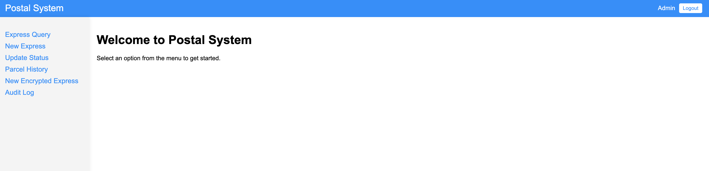

### Create Parcel Page
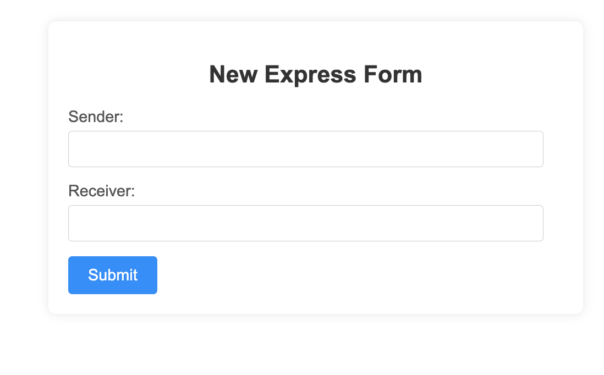

### Parcel List Page
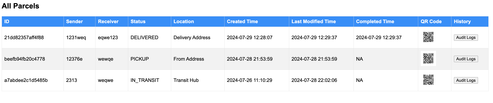

### Scan Parcel's QR Code
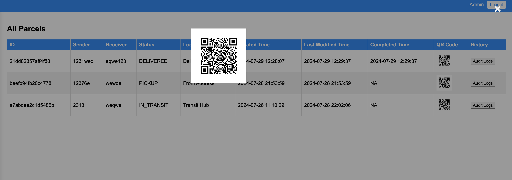

### After Scan
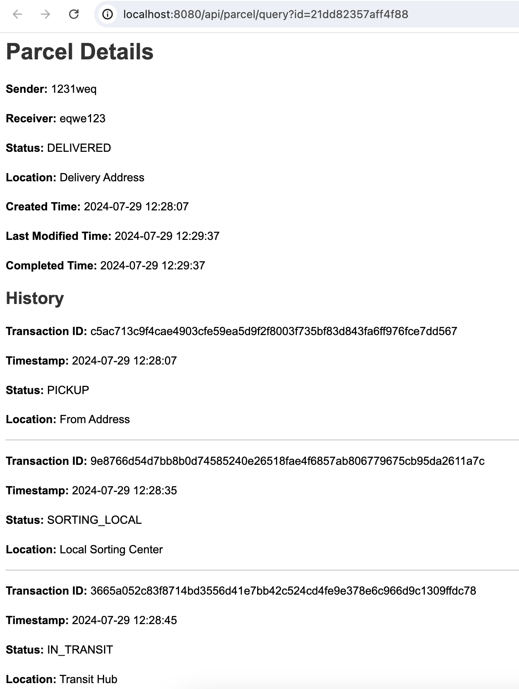

### Update Parcel
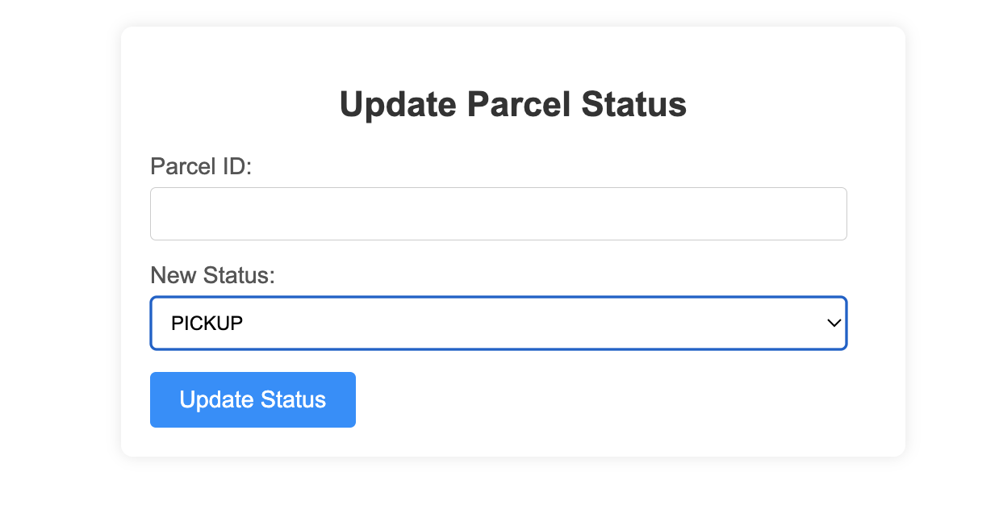
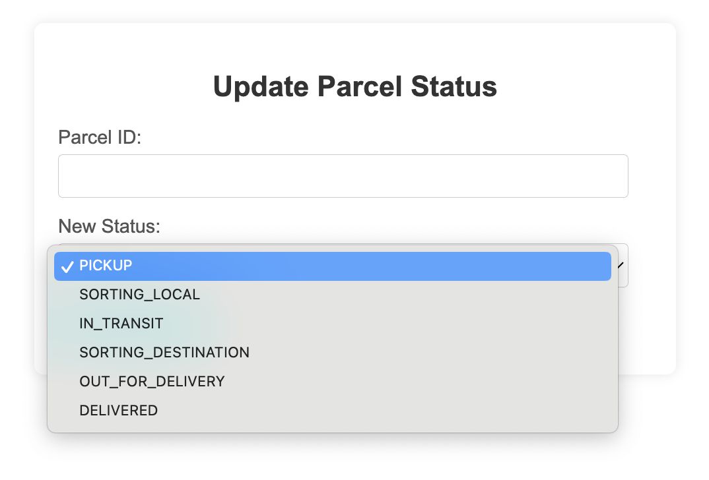

### Parcel History
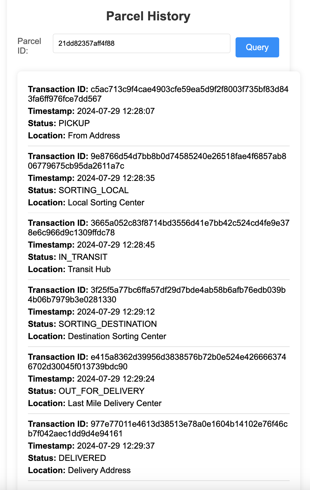

## Hyperledger Explorer

### Dashboard
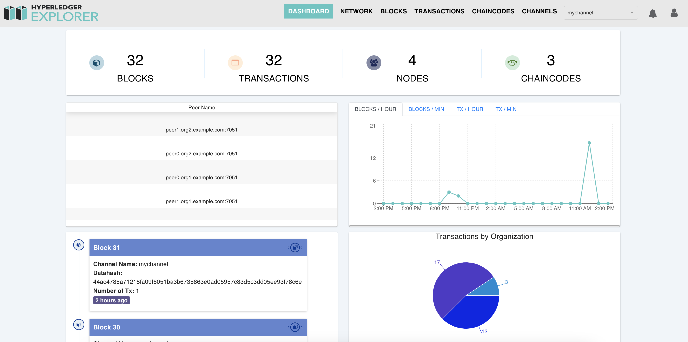

### Transaction
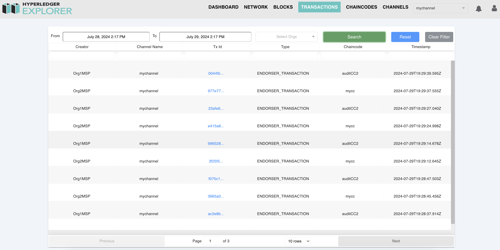

### Chaincode
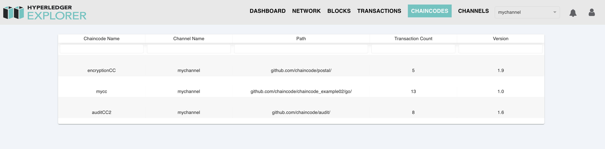
